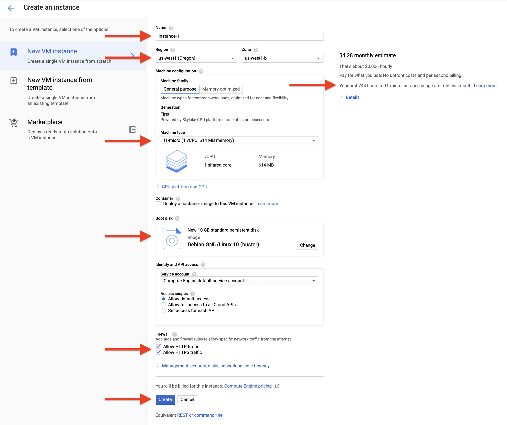
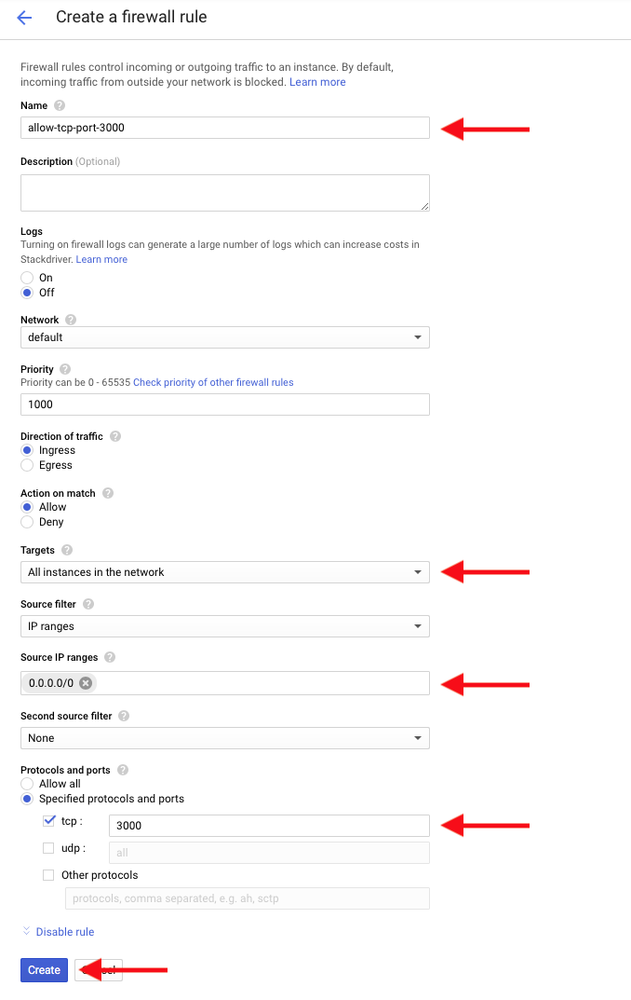

## Project 2

In our second project, you'll get a server up and running, and write and deploy some React-based code using a node.js server. (OMG what does that all mean?)

The goals are:
- Build on knowledge of HTML/CSS.
- Learn basics of the React front-end library.
- Learn how to save data.
- Learn how web *browsers* interact with web *servers*.
- Get comfortable with the command line.
- Get experience with Google Cloud Platform.

### Week 1

First, we'll start with a refresher on HTML. Follow along!

Let's start with a very basic choose-your-own-adventure style website. Here's some code to get us started:

```javascript
import React, { Component } from "react";

import "./styles.css";

var pages = {
  start: {
    text: "Welcome, traveler! How would you like to get to your destination?",
    leftLabel: "Train",
    rightLabel: "Ship",
    leftPage: "onthetrain",
    rightPage: "ontheship"
  },
  onthetrain: {
    text:
      "Welcome aboard the choo-choo train! Please make your way to your seat. What's the number?",
    leftLabel: "12E",
    rightLabel: "97C",
    leftPage: "death",
    rightPage: "life"
  }
};

class App extends Component {
  constructor(props) {
    super(props);

    this.state = {
      page: "start"
    };
  }

  goToPage(pageName) {
    this.setState({
      page: pageName
    });
  }

  render() {
    var pageData = pages[this.state.page];

    return (
      <div className="App">
        <p>{pageData.text}</p>
        <button onClick={() => this.goToPage(pageData.leftPage)}>
          {pageData.leftLabel}
        </button>
      </div>
    );
  }
}

export default App;
```

Paste this code into a new, fresh "React Sandbox" at [codesandbox.io](http://codesandbox.io).


#### Homework 1

This week's homework is to continue the exercises from class:

1. Extend your Choose-your-own-Adventure to include at least 10 pages and a reasonable narrative.

2. Add images to your pages.

3. Add the ability to specify up to three buttons per page. *Hint*: try using `if` statements in the `render()` function, [as we did in class for the `` tag](optional-image.js). **Bonus challenge:** enable the ability to specify as many buttons as you want! Perhaps with an array of buttons?

4. Learn a bit of CSS and style things! Make them pretty!

Submit your homework by exporting your project to GitHub by clicking on the GitHub icon (Octocat thing), then [emailing us](mailto:zamfi@cca.edu,rolf.widenfelt@cca.edu) both a link to your GitHub repository and a link to your published CodeSandbox.

[Here's a solution to buttons question that uses arrays](cyoa-buttons.js)

### Week 2

This week, we'll look at inputs: how do you actually collect information from a user? Let's start with [this code](cyoa-inputs.js).

In class, we completed these exercises:

1. Add an input for birthday, and display it.
2. Add a third input.
3. **Challenge**: Display "happy birthday" if the birthday is today!

#### Homework 2

**Assignment:** For homework, create a set of [mad libs](https://en.wikipedia.org/wiki/Mad_Libs) -- like your previous choose-your-own-adventure, the first several pages in your mad lib should collect words or other input from viewers, and then the last page should insert those words into a funny paragraph! 

Use at least 3 pages to collect at least 8 words. The words can be traditional mad lib categories like nouns, verbs, adjectives, etc., or they can be whatever you choose. Create your own paragraph for the final page (don't use the one from Wikipedia!), and insert the collected words into it.

That's it. Have fun with this!

Don't forget to [email us both](mailto:zamfi@cca.edu,rolf.widenfelt@cca.edu) your code in GitHub and a link to your CodeSandbox.

### Week 3

Yet another version of choose your own adventure! This time, we created a new class for each page. Because making a JSON object was getting ridiculous.

[Here it is!](cyoa-components.js)

No homework this week, except to prepare for next week's command line-heavy class by following along to [these](https://youtu.be/5XgBd6rjuDQ) [two](https://youtu.be/-Vl4rpZVA6I) videos. Feel free to use Terminal if you're on a Mac, but use [this web-based terminal](https://bellard.org/jslinux/vm.html?url=buildroot-x86.cfg) if you're on Windows!

<!--
Make the following changes to that code:

1. Use `<input>` element, instead of buttons, to record the seat number on the `TrainPage` page.

2.  Use a `<select>` element for the seat number. Here's an example set of code:
    
    ```javascript
    <select value={this.props.data.seat} onChange={this.props.setStateFunction(“seat”, event.target.value)}>
      <option value="12">Seat 12</option>
      <option value="13">Seat 13</option>
      <option value="14">Seat 14</option>
      <option value="15">Seat 15</option>
    </select>
    ```

3. Add a page later in your narrative whose content depends on seat choice. E.g., if it's an even or odd number!

4. Use data from a Weather API to influence the outcome of a page. For exmple, if it's snowy in Fargo, ND -- maybe your train gets stuck in a snowstorm?
-->

### Week 4

This week, we'll get your code off of codesandbox.io and running in a publicly-accessible place on the web.

We'll be using the command line a lot this week. While the installs are happening, take a quick look at this [list of terminal commands](https://files.fosswire.com/2007/08/fwunixref.pdf) to refresh you memory.

Preparation:

1. Create a GitHub repository for your latest code. In codesandbox.io, click the GitHub icon on the left, give your repository a name, and save it.

2. Visit the GitHub repository for your project. You should see a "clone or download" button, click on `https` and copy that link. Save it somewhere on your computer so you can refer to it later!

#### Using Google Cloud Platform

Most modern laptops are capable of running your code as-is -- but of course, that only works as long as your laptop is open, and only allows connections from the local wifi network. To get your code running on the web permanently, we can use Google Cloud Platform!

Sign up for a [Google Cloud Platform account](https://console.cloud.google.com/). You'll need to enter a credit card to prove you're human, but you won't be charged if you follow these directions correctly!

Create a new project, then navigate to `Compute Engine` > `VM Instances` and create a new VM. You'll want to use these settings to make sure it's free! Pick your own name, though, obviously. (You may need to create a "project" for this.)
Note: Under the `Boot disk` choice, make sure you change to Linux 10, not Linux 9.



Once you've created your instance, you'll need to open a specific `port` to allow our development server to be publicly accessible on the internet. To do that, navigate to `VPC Network` > `Firewall Rules` and click on `Create Firewall Rule`.
**Note:** this section is a bit hard to find. Click on `Google Cloud Platform` icon in the upper left, and scroll down until you see `VPC Network`.
Use these settings:



With these done, go back to `Compute Engine` > `VM Instances` and Start your VM instance. Once it's running, you can connect to it with the `SSH` link. It'll open a terminal where you can issue commands.

Start with this:

```
sudo apt-get install git nodejs npm
```

This will install git, node, and npm on your remote server, allowing you to clone your code, and run the node server. Do so by following these steps:

1. Type `git clone ` followed by a space. Then find the `https` link you copied earlier to your repository. Paste it in and then hit return. This will copy your code into the folder you're in. Then `cd` into the folder created by `git clone`. Use `ls` to show you the contents of the folder you're in!

2. Run `npm install` -- this will install all the libraries that your project depends on, including react and some other stuff.

3. Run `npm start` -- this will start your project, and open a browser window pointed at the node server that's running your code!

Lastly, you'll need to get your IP address from the GCP dashboard, something like 35.247.65.57, and then visit `35.247.65.57:3000` in your browser, replacing `35.247.65.57` with the IP address that you actually have.

That `:3000` tells your server to connect to the program running on *port 3000*, which happens to be the port that React is using.

#### Running Permanently

You may have noticed that closing the SSH window eventually stops your server from responding. That's because once the terminal running your server shuts down, your server shuts down with it.

One way to get your server to run permanently is to use a program called `screen`, which basically creates a "fake" terminal that you can "disconnect" from but that keeps running in the background. The `screen` program isn't installed by default, so start by installing it. SSH back into your server and run `sudo apt install screen`. 

Then, `cd` into the folder containing your project. (Hint: you'll know you're in the right place if typing `ls` gives you a list of files that includes `package.json`.) Run `screen`. Then, run `npm start` to start your server in that screen terminal. Now you have your server running inside a terminal that *won't* shut down when you close the SSH connection. Wait for the `npm start` command to take effect -- telling you your server is running -- and then press `control-A` to enter "command mode" in screen, and then press `D` to "disconnect" from your terminal. This should take you back to your command line with some statement along the lines of `[detached from ...]`.

Now, close your terminal and you should be golden! Server should still be up and running.

Your homework for this week is as follows:

1. Get your server up and running permanently. Send me a link to the IP address and port!
2. Make your choose your own adventure game beautiful and functional! This is the last week we'll spend working on it, so make something you're proud of!
3. **Optional Challenge:** Use a server like `nginx`, which you can install with `sudo apt install nginx`, to run your server without needing to specify a port number (like 3000). You are basically trying [to do this](https://stackoverflow.com/questions/24861311/forwarding-port-80-to-8080-using-nginx).
4. **Optional Challenge**: Register a domain name and point it to your IP address. With 3 and 4 done, you'll have a fully functioning website running your app!

Don't forget to also add to your project decompositions list your render- and data-focused decomposition of a computer or video game!
